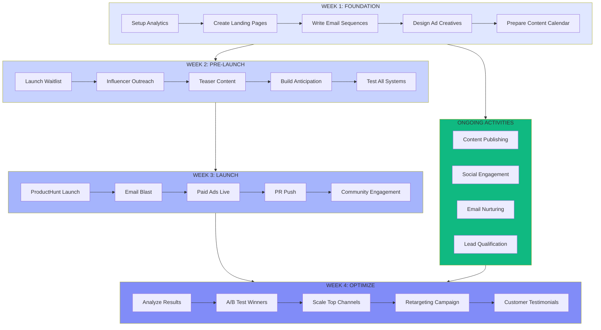

# Campaign Flowchart - FlowMetrics Launch

## Visual Workflow

## Phase Details

### Week 1: Foundation

**Tasks:**
- [ ] Setup analytics tracking
- [ ] Create landing pages
- [ ] Write email sequences
- [ ] Design ad creatives
- [ ] Prepare content calendar

**Deliverables:**
- Landing page live
- 5 email sequences
- 20 ad variations

### Week 2: Pre-Launch

**Tasks:**
- [ ] Launch waitlist campaign
- [ ] Reach out to 50 influencers
- [ ] Publish teaser content
- [ ] Build anticipation on social
- [ ] Test all systems end-to-end

**Deliverables:**
- 500 waitlist signups
- 10 influencer confirmations

### Week 3: Launch

**Tasks:**
- [ ] ProductHunt launch
- [ ] Email blast to waitlist
- [ ] Activate paid ads
- [ ] PR outreach
- [ ] Community engagement

**Deliverables:**
- Top 5 on ProductHunt
- 200 trial signups
- 50K impressions

### Week 4: Optimize

**Tasks:**
- [ ] Analyze week 3 results
- [ ] A/B test top performers
- [ ] Scale winning channels
- [ ] Launch retargeting
- [ ] Collect testimonials

**Deliverables:**
- Campaign report
- 3 testimonials
- Optimized funnel

