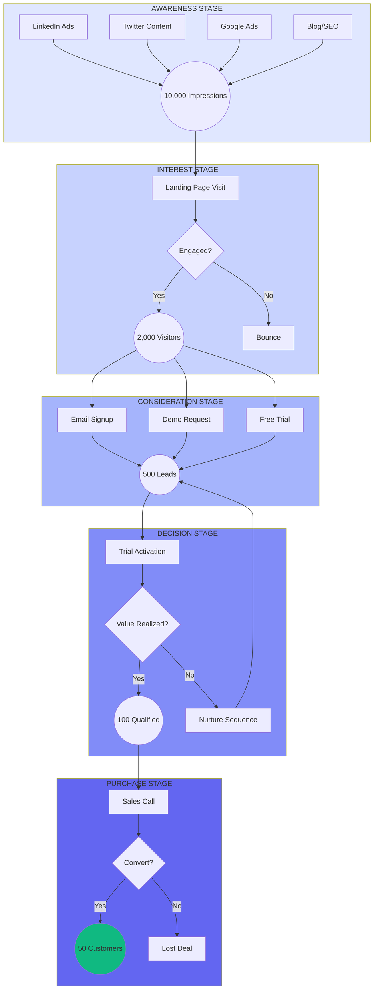

# Sales Funnel - FlowMetrics Launch Campaign

## Funnel Visualization

## Funnel Metrics

| Stage | Metric | Target | Conversion Rate |
|-------|--------|--------|----------------|
| Awareness | Impressions | 10,000 | - |
| Interest | Website Visitors | 2,000 | 20% |
| Consideration | Leads | 500 | 25% |
| Decision | Qualified Leads | 100 | 20% |
| Purchase | Customers | 50 | 50% |

## Channel Mix by Stage

**Awareness:** LinkedIn Ads, Twitter Content, Google Ads, Blog/SEO

**Interest:** Landing Page, Product Demo Video, Case Studies

**Consideration:** Email Nurture, Free Trial, Demo Calls

**Decision:** Sales Calls, Custom Demos, Proposal

**Purchase:** Contract, Onboarding, Success Check-in

